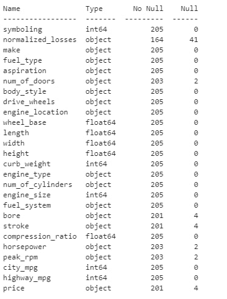
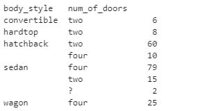
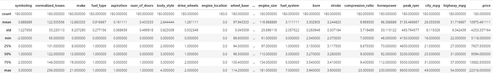
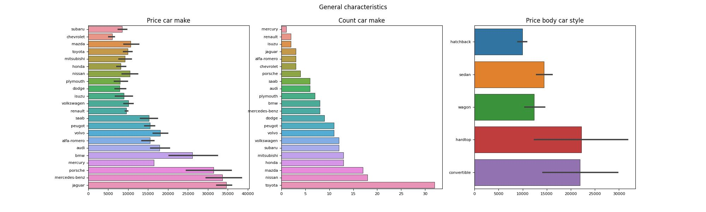
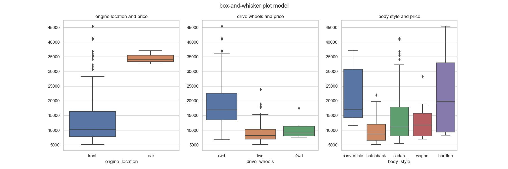
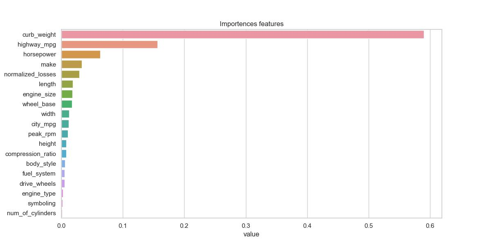
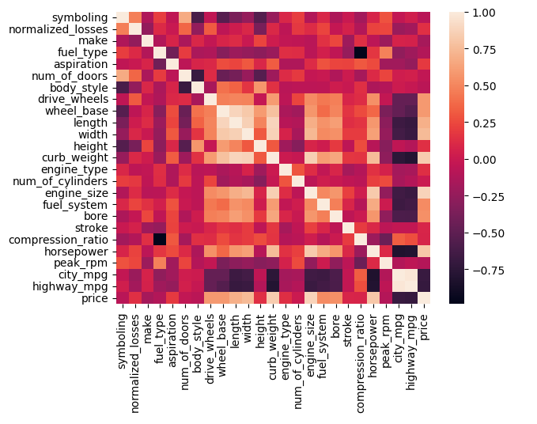

### Data Analysis 
During the study of the given data frame, it was decided to reject the zero values of the price, to replace all numerical values with the average, and to process the string values separately.

<b>84.04%</b> Sedan is four doors.

* It was reasonable if missed data for the number of doors will be replace by four.

We exclude extreme data, the total number decreased to 180

### Correlation

After the correlation of the data, 20 features remained from the 26 presented, and the 3 most important features were also determined.

<b>Features vs Price:</b>

* Symboling feature vs Price is 0.036, p-value is 0.6331842154850545 
* Normalized losses feature vs Price is 0.317, p-value is 1.4352759788069227e-05 
* Make feature vs Price is 0.005, p-value is 0.9465789197062073 
* Body style feature vs Price is 0.085, p-value is 0.25421650817357294 
* Drive wheels feature vs Price is 0.565, p-value is 1.5008084787375338e-16 
* Wheel base feature vs Price is 0.612, p-value is 7.210669291835463e-20 
* Length feature vs Price is 0.716, p-value is 1.3237649365440924e-29 
* Width feature vs Price is 0.745, p-value is 4.483940735629761e-33 
* Height feature vs Price is 0.187, p-value is 0.012055937204577285 
* Curb weight feature vs Price is 0.838, p-value is 1.3532161301065677e-48 
* Engine type feature vs Price is 0.053, p-value is 0.4819564774757745 
* Num of cylinders feature vs Price is 0.155, p-value is 0.03756021162069747 
* Engine size feature vs Price is 0.725, p-value is 1.1540207363299491e-30 
* Fuel system feature vs Price is 0.671, p-value is 7.219421668533878e-25 
* Compression ratio feature vs Price is 0.022, p-value is 0.766261136862567 
* Horsepower feature vs Price is 0.769, p-value is 2.0073201202419802e-36 
* Peak rpm feature vs Price is 0.046, p-value is 0.5410315199111934 
* City mpg feature vs Price is 0.714, p-value is 2.591260715545443e-29 
* Highway mpg feature vs Price is 0.699, p-value is 1.0327686400384447e-27

#### from the following features of the car, the most influential can be singled out:

* <b>Curb weight</b> feature vs Price is 0.838, p-value is 1.3532161301065677e-48 
* <b>Horsepower</b> feature vs Price is 0.769, p-value is 2.0073201202419802e-36 
* <b>Engine size</b> feature vs Price is 0.725, p-value is 1.1540207363299491e-30 
* City mpg feature vs Price is 0.714, p-value is 2.591260715545443e-29 
* Highway mpg feature vs Price is 0.699, p-value is 1.0327686400384447e-27 
* Fuel system feature vs Price is 0.671, p-value is 7.219421668533878e-25 

### Visualization

general characteristics broken down by product manufacturer and body type

|  |
|:--:|
|<b>Img.1 - general characteristics</b>|

As can be seen from the graphs, the most expensive cars are Jaguar, Mercedes-Benz, Porsche and BMW 
The largest number of presented cars from the manufacturer toyota 
The most diverse styles of the car are represented by a hardtop and a convertible with a minimum price of 12 thousand and a maximum of about 30 thousand and more

|  |
|:--:|
|<b>Img.2 - linear reg characteristics</b>|

The fuel consumption ratio in the city and outside the city increases, and the price decreases. The situation is reversed with the size of the engine, as the size increases, the price increases.

|  |
|:--:|
|<b>Img.3 - box-plot characteristics</b>|

* According to the chart above, rear-engine cars have an average price of 35,000, front-engined cars range in price from 8,000 to 30,000, and the median is around 10,000.  But there are a small number that fall outside their chart . the price varies from 30 thousand to more than 45 thousand. 
* The driving wheels of expensive cars are of the rwd type, the median number is about 17,000 and the larger number is concentrated from 14,000 to about 23,000.

|  |
|:--:|
|<b>Img.4 - Importences features using RandomForest</b>|

Using powerful tree-based ML models (random forest), calculated importences featyres

|  |
|:--:|
|<b>Img.5 - Correalation features </b>|

Correlation of the data that we marked as important was carried out

