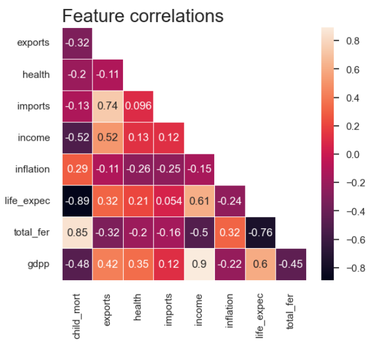
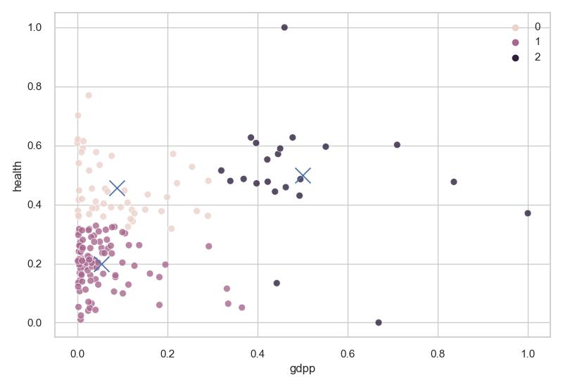
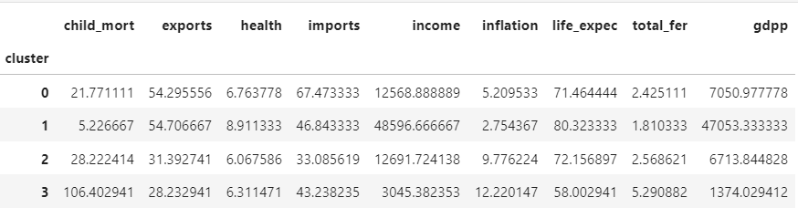
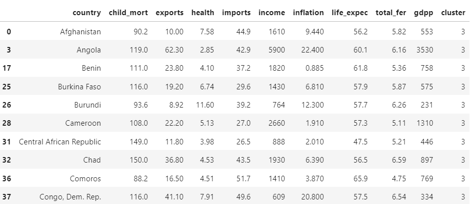

## Перевірка різних методів кластерізації

За графіками кластерів наглядно видно що метод Dbscan не підходить, найкращими методами можно виявити спектральний метод та k-mean очікування-максимізації

Використовуючи метод очікування максимізації побудуємо всі наступні графіки з автоматичним виявилення кількость центрів

 
## Проводимо кореляцію даних для визначення цінних рис
 

За даною кореляцію можна зазначити наступне:

* Як і очіковалось <b>термін життя</b> сильно залежить від дитячою смертності, а також народжуванності дитини а також від дохіда
* Як і очікувалось теж саме стосується "продолородності"
Тож можно не звертати увагу на ці дані

Як можно побачити більш нужденні країни знаходиться в 0 кластері з великою смертністю дітей і нізькою Валовим внутрішнім продуктом

Як можно побачити більш нужденні країни знаходиться в 1 кластері з низьким відсотком вкладенням коштів в здоров'є і нізькою Валовим внутрішнім продуктом

Після остаточної кластерізації всіх вказаних рис можно побачити зв'язок, 3 кластер відносить себе до стран яким треба допомогити 
Країни 3-світу

Всі останні країни надані в результуючуми файлі
