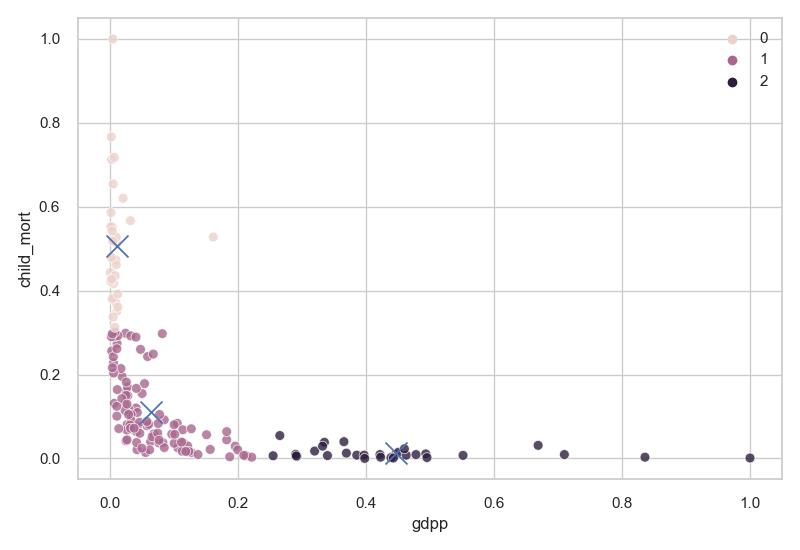

<h2>Перевірка різних методів кластерізації</h2>

За графіками кластерів наглядно видно що метод Dbscan не підходить, найкращими методами можно виявити спектральний метод та k-mean очікування-максимізації

Використовуючи метод очікування максимізації побудуємо всі наступні графіки з автоматичним виявилення кількость центрів

 
<h2>Проводимо кореляцію даних для визначення цінних рис</h2>
 

За даною кореляцію можна зазначити наступне:

<ol>
  <li>Як і очіковалось <b>термін життя</b> сильно залежить від дитячою смертності, а також народжуванності дитини а також від дохіда</li>
  <li>Як і очікувалось теж саме стосується "продолородності"</li>
</ol>
Тож можно не звертати увагу на ці дані
 
<h2>Проводимо кластерізацію методом K-Means</h2>

Як можно побачити більш нужденні країни знаходиться в 0 кластері з великою смертністю дітей і нізькою Валовим внутрішнім продуктом

Як можно побачити більш нужденні країни знаходиться в 1 кластері з низьким відсотком вкладенням коштів в здоров'є і нізькою Валовим внутрішнім продуктом

 

Після остаточної кластерізації всіх вказаних рис можно побачити схожість даних в третьоиу кластері, більш всього від відносить себе до стран яким треба термінова допомога

Країни 3-світу

Всі останні країни надані в результуючуми файлі
<h2>Висновок</h2>

Протестуючи наші дані на різних методах кластерізації, можно знайти, один який найкраще підходить відконувши інші. Проведячи коряліцію можно знайти дані які сильно залежать від інших і тит самими відкинути їх. Провели аналіз даних. Вибраний метод використали для кластерізації 2 параметрів. Знайшли схожесть груп кластерів. Після декількох кластерізацій можно виділити групу стран яким потрібна допомога.

<h2>Порівняльна характеристика двух методів кластерізації</h2>

|country                 |gdpp                 |result_cl|cl_child_mort|cl_exports|cl_health|cl_imports|cl_income|cl_inflation|cl_life_expec|cl_total_fer|
|------------------------|---------------------|---------|-------------|----------|---------|----------|---------|------------|-------------|------------|
|Niger                   |0.00112              |3        |0            |1         |1        |1         |0        |0           |0            |1           |
|Madagascar              |0.00174              |3        |1            |1         |1        |1         |0        |0           |0            |1           |
|Mozambique              |0.00179              |3        |0            |1         |1        |1         |0        |0           |0            |1           |
|Central African Republic|0.00205              |3        |0            |1         |1        |1         |0        |0           |0            |1           |
|Malawi                  |0.00218              |3        |0            |1         |1        |1         |0        |0           |0            |1           |
|Eritrea                 |0.0024               |3        |1            |1         |1        |1         |0        |0           |0            |1           |
|Gambia                  |0.00316              |3        |0            |1         |1        |1         |0        |0           |0            |1           |
|Burkina Faso            |0.00328              |3        |0            |1         |1        |1         |0        |0           |0            |1           |
|Nepal                   |0.00345              |3        |1            |1         |1        |1         |0        |1           |1            |0           |
|Guinea                  |0.00398              |3        |0            |1         |1        |1         |0        |1           |0            |1           |
|Tanzania                |0.0045               |3        |0            |1         |1        |1         |0        |0           |0            |1           |
|Mali                    |0.00455              |3        |0            |1         |1        |1         |0        |0           |0            |1           |
|Bangladesh              |0.00503              |3        |1            |1         |1        |1         |0        |0           |1            |0           |
|Benin                   |0.00503              |3        |0            |1         |1        |1         |0        |0           |0            |1           |
|Comoros                 |0.00514              |3        |0            |1         |1        |1         |0        |0           |0            |1           |
|Chad                    |0.00636              |3        |0            |1         |1        |1         |0        |0           |0            |1           |
|Kenya                   |0.00702              |3        |1            |1         |1        |1         |0        |0           |0            |1           |
|Myanmar                 |0.00723              |3        |1            |1         |1        |1         |0        |0           |0            |0           |
|Senegal                 |0.00734              |3        |0            |1         |1        |1         |0        |0           |0            |1           |
|Pakistan                |0.00772              |3        |0            |1         |1        |1         |0        |0           |0            |1           |
|Lao                     |0.00868              |3        |0            |1         |1        |1         |0        |0           |0            |0           |
|Cote d'Ivoire           |0.00944              |3        |0            |0         |1        |1         |0        |0           |0            |1           |
|Cameroon                |0.0103               |3        |0            |1         |1        |1         |0        |0           |0            |1           |
|Ghana                   |0.0103               |3        |0            |1         |1        |1         |0        |1           |0            |1           |
|Yemen                   |0.0103               |3        |1            |1         |1        |1         |0        |1           |1            |1           |
|India                   |0.01068              |3        |1            |1         |1        |1         |0        |0           |0            |0           |
|Uzbekistan              |0.01097              |3        |1            |1         |1        |1         |0        |1           |1            |0           |
|Zambia                  |0.01173              |3        |0            |1         |1        |1         |0        |1           |0            |1           |
|Sudan                   |0.01192              |3        |0            |1         |1        |1         |0        |1           |0            |1           |
|Bolivia                 |0.01669              |3        |1            |1         |1        |1         |0        |0           |1            |0           |
|Philippines             |0.01813              |3        |1            |1         |1        |1         |0        |0           |1            |0           |
|Nigeria                 |0.02003              |3        |0            |1         |1        |1         |0        |1           |0            |1           |
|Egypt                   |0.02261              |3        |1            |1         |1        |1         |0        |0           |1            |0           |
|Sri Lanka               |0.02462              |3        |1            |1         |1        |1         |0        |1           |1            |0           |
|Morocco                 |0.02481              |3        |1            |1         |1        |1         |0        |0           |1            |0           |
|Guatemala               |0.02481              |3        |1            |1         |1        |1         |0        |0           |1            |0           |
|El Salvador             |0.02633              |3        |1            |1         |1        |1         |0        |0           |1            |0           |
|Indonesia               |0.02748              |3        |1            |1         |1        |1         |0        |1           |1            |0           |
|Armenia                 |0.02853              |3        |1            |1         |1        |1         |0        |0           |1            |0           |
|Paraguay                |0.02862              |3        |1            |0         |1        |1         |0        |0           |1            |0           |
|Angola                  |0.03149              |3        |0            |0         |1        |1         |0        |1           |0            |1           |
|Albania                 |0.03683              |3        |1            |1         |1        |1         |0        |0           |1            |0           |
|Turkmenistan            |0.04017              |3        |1            |0         |1        |1         |0        |0           |1            |0           |
|Algeria                 |0.04036              |3        |1            |1         |1        |1         |0        |1           |1            |0           |
|China                   |0.04132              |3        |1            |1         |1        |1         |0        |0           |1            |0           |
|Jamaica                 |0.04246              |3        |1            |1         |1        |1         |0        |0           |1            |0           |
|Peru                    |0.04571              |3        |1            |1         |1        |1         |0        |0           |1            |0           |
|Dominican Republic      |0.04981              |3        |1            |1         |1        |1         |0        |0           |1            |0           |
|Azerbaijan              |0.05354              |3        |1            |0         |1        |1         |0        |1           |1            |0           |
|Iran                    |0.06012              |3        |1            |1         |1        |1         |0        |1           |1            |0           |
|Grenada                 |0.06814              |3        |1            |1         |1        |1         |0        |0           |1            |0           |
|Romania                 |0.07635              |3        |1            |1         |1        |1         |0        |0           |1            |0           |
|Suriname                |0.07702              |3        |1            |0         |1        |1         |0        |0           |1            |0           |
|Gabon                   |0.08131              |3        |1            |0         |1        |1         |0        |1           |0            |1           |
|Kazakhstan              |0.08437              |3        |1            |0         |1        |1         |1        |1           |1            |0           |
|Turkey                  |0.09992              |3        |1            |1         |1        |1         |1        |0           |1            |0           |
|Russia                  |0.09992              |3        |1            |1         |1        |1         |1        |1           |1            |0           |
|Libya                   |0.11329              |3        |1            |0         |1        |1         |1        |1           |1            |0           |
|Venezuela               |0.12665              |3        |1            |1         |1        |1         |1        |1           |1            |0           |
|Saudi Arabia            |0.18201              |3        |1            |0         |1        |1         |1        |1           |1            |0           |
|Oman                    |0.18201              |3        |1            |0         |1        |1         |1        |1           |1            |0           |
|South Korea             |0.20874              |3        |1            |0         |0        |1         |1        |0           |1            |0           |
|Singapore               |0.44258              |3        |2            |2         |2        |2         |2        |3           |2            |2           |
