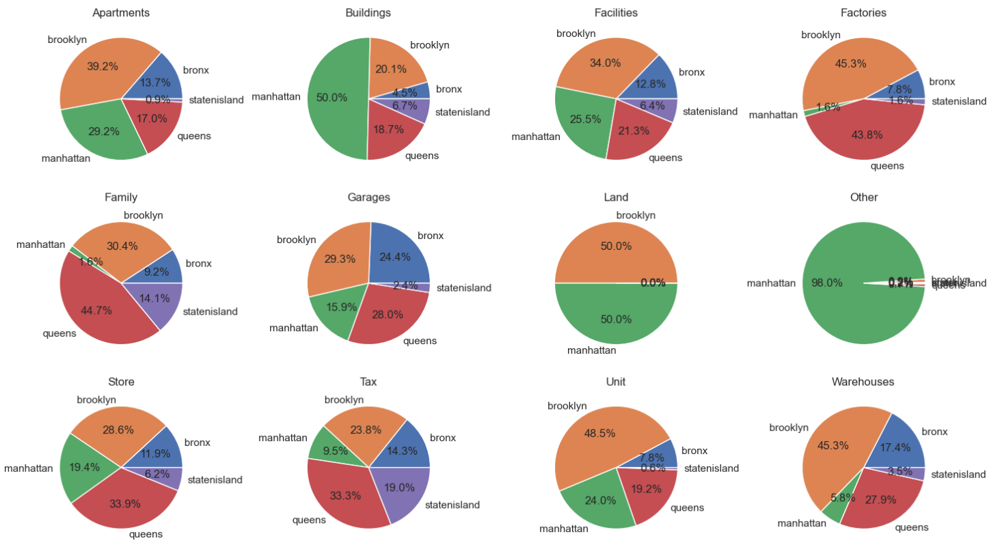

# Лабораторна робота №1

Ви – щойно нанятий data analyst у великій американській компанії, яка працює на ринку нерухомості США. На черговому засіданні ваш бос дав вам завдання зробити аналітичний звіт по цікавому йому сегменту ринку - Нью-Йорку
## Завдання до виконання
* Виконайте дослідження domain experience стосовно американського ринку нерухомості. Ознайомтесь з декількома прикладами аналітичних продуктів від топових гравців на американському ринку, направлених на інвесторів. Питання, які потрібно опрацювати:
  * Як топові компанії на ринку складають звіти по нерухомості?
  * Які графіки використовуються для донесення інформації?
  * Які співвідношення між якими даними по ринку є показовими для інвесторів / керівників агенцій нерухомості?
  * Яка термінологія використовується для опису закономірностей на ринку нерухомості?
* Завантажити файли з даними у папку проекту з посилання: 
https://www1.nyc.gov/site/finance/taxes/property-rolling-sales-data.page
* Очистити дані.
* Виконайте розвідувальний аналіз, щоб дізнатися, де є викиди або відсутні значення, вирішіть, як ви їх будете обробляти, переконайтеся, що дати відформатовані правильно, значення, які ви вважаєте числовими, розглядаються як такі і т.д.
* Виконайте аналіз розвідувальних даних (отриманих результатів) для візуалізації та зіставлення за житловими масивами та за часом. Почніть шукати осмислені закономірності у цьому наборі.
* Зберіть висновки у невеликий звіт для генерального директора (графіки, висновки з текстом у окремому файлі), який потребує належного оформлення висновків, структури тощо.
* Завантажити звіт та файл ipynb з виконаними завданнями на git в окрему папку з відповідною назвою лабораторної роботи

## Хід виконання роботи:

