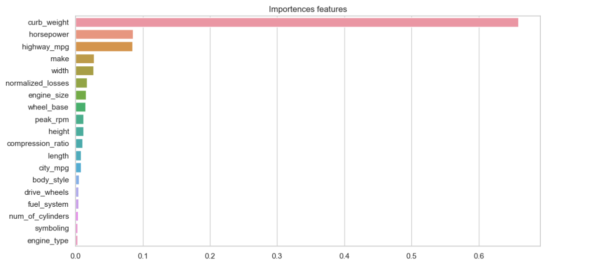
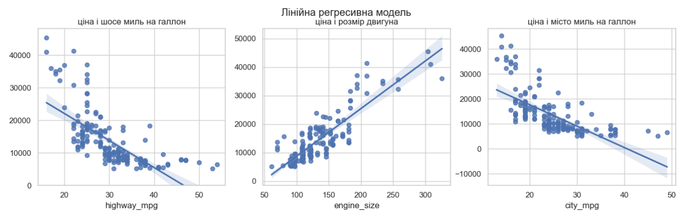
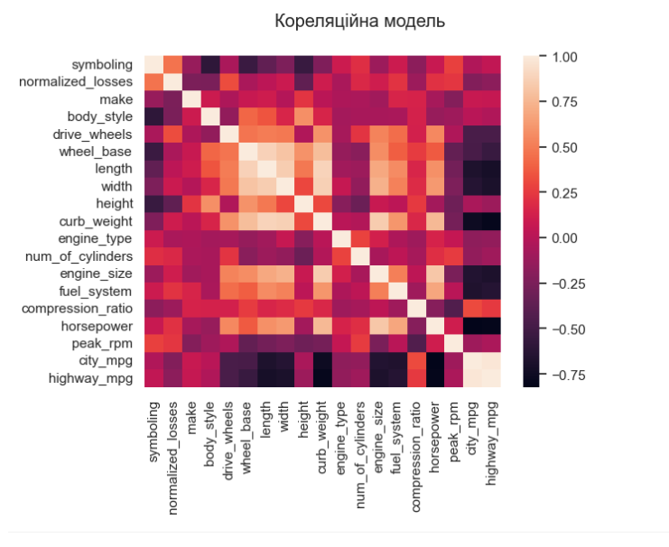

# Лабораторна робота №3
Методи аналізу та вибору значущих ознак (Features’ Selection Procedures)
## Завдання:

* Ознайомитись з наданим прикладом використання різних методів відбору значущих ознак (папка Example).
* Завантажити файли з даними у папку проекту з посилання: 
https://drive.google.com/file/d/1su22-W8JrRZzm0mea5v8x46YmLh083qp/view?usp=sharing
* Очистити дані та обробити відсутні дані.
* Зробити EDA по ознаках.
1) Проаналізуйте надані дані, використовуючи методи з прикладу та документації, та зберіть результати аналізу у результуючий ранжируваний датафрейм, в якому лівим індексом будуть ознаки, а колонки – результати однофакторного аналізу ознак. Подумайте над системою ранжування такою, яка б враховувала наявність багатьох факторів ранжування (припустимо, що всі вони мають однакову вагу на прийняття вами рішення).
2) Проаналізуйте ознаки на взаємозалежність, та побудуйте відповідні heatmap засобами seaborn по кожному з використаних методів дослідження. 
3) Зберіть висновки у звіт (графіки, висновки текстом у окремому файлі), який потребує належного оформлення, структури тощо.
4) Завантажити звіт та файл ipynb з виконаними завданнями на git в окрему папку з відповідною назвою лабораторної роботи

## Хід виконання роботи:

1) <b>Виявляємо пропущені дані</b>.
Конвертуємо “?” в NaN
2) <b>Перевіряємо кількість пропусків у кожному стовпці</b> 
   Кожен стовпець містить 205 рядків даних і 7 стовпців, у яких відсутні дані:
   * <b> нормалізувати втрати </b>: 41 відсутня дана
   * <b>Кількість дверей</b>: 2 відсутні дані
   * <b>отвір</b>: 4 відсутні дані
   * <b>обведення</b>: 4 відсутні дані
   * <b>кінська сила</b>: 2 відсутні дані
   * <b>пікова кількість обертів на хвилину</b>: 2 відсутні дані
   * <b>ціна</b>: 4 відсутні дані
3) <b>Перевіряємо на тип даних кожен стовпець</b> 
Також в даних колонках неправильно виявлені типи даних,y наступних 6 колонках неправильно представлені типи даних:
   * нормовані втрати - об'єкт
   * отвір - об'єкт
   * обведення - об'єкт
   * кінська сила - об'єкт
   * пікова кількість обертів на хвилину - об'єкт
   * ціна - об'єкт

Повний список

| index | name              | type    | not null | null |
|-------|-------------------|---------|----------|------|
| 0     | symboling         | int64   | 205      | 0    |
| 1  | normalized_losses | object  | 164      | 41   |
| 2  | make              | object  | 205      | 0    |
| 3  | fuel_type         | object  | 205      | 0    |
| 4  | aspiration        | object  | 205      | 0    |
| 5  | num_of_doors      | object  | 203      | 2    |
| 6  | body_style        | object  | 205      | 0    |
| 7  | drive_wheels      | object  | 205      | 0    |
| 8  | engine_location   | object  | 205      | 0    |
| 9  | wheel_base        | float64 | 205      | 0    |
| 10 | length            | float64 | 205      | 0    |
| 11 | width             | float64 | 205      | 0    |
| 12 | height            | float64 | 205      | 0    |
| 13 | curb_weight       | int64   | 205      | 0    |
| 14 | engine_type       | object  | 205      | 0    |
| 15 | num_of_cylinders  | object  | 205      | 0    |
| 16 | engine_size       | int64   | 205      | 0    |
| 17 | fuel_system       | object  | 205      | 0    |
| 18 | bore              | object  | 201      | 4    |
| 19 | stroke            | object  | 201      | 4    |
| 20 | compression_ratio | float64 | 205 | 0 |
| 21 | horsepower        | object  | 203 | 2 |
| 22 | peak_rpm          | object  | 203 | 2 |
| 23 | city_mpg          | int64   | 205 | 0 |
| 24 | highway_mpg       | int64   | 205 | 0 |
| 25 | price             | object  | 201 | 4 |

4) Заміняємо відсутні значення або видаляємо їх 
    <b>Замінити на середнє значення:</b>
    <ul>
        <li><b>нормалізовані втрати</b>: 41 відсутні дані, замініть їх середніми значеннями</li>
        <li><b>штрих</b>: 4 відсутні дані, замініть їх середніми</li>
        <li><b>отвір</b>: 4 відсутні дані, замініть їх середніми</li>
        <li><b>кінська сила</b>: 2 відсутні дані, замініть їх середніми значеннями</li>
        <li><b>peak-rpm</b>: 2 відсутні дані, замініть їх середніми</li>
    </ul>
    
    <b>Відкинути всі 6 рядки:</b>
    <ul>
        <li><b>ціна</b>: 4 відсутні дані, видалити </li>
        <li><b>кількість дверей</b>: 2 відсутні дані, видалити</li>
    </ul>
5) <b>Квантиль</b> 
Використовуємо квантиль для відсікання дуже екстремальних значень, кількість залеших даних 179 з 205 (26)
6) <b>Описовий статистичний аналіз</b>  
Після відсікання колонок залишилось 19 колонок з 24
   * Символіка - 0,057
   * Нормовані втрати - 0,299
   * Виробник - 0,02
   * Тип кузова - 0.092
   * Ведучі колеса - 0,571
   * Колісна база - 0,623
   * Довжина - 0,72
   * Ширина - 0,752
   * Висота - 0,191
   * Споряджена маса - 0,84
   * Тип двигуна - 0,053
   * Кількість циліндрів - 0.169
   * Об'єм двигуна - 0.724
   * Паливна система - 0,662
   * Ступінь стиснення - 0,073
   * Кінська сила - 0,762
   * Пікові оберти - 0,054
   * Місто mpg - 0,706
   * Шосе mpg - 0,701
7) Після кореляції Пірсинга можна визначити риси з сильним коїфіціентом
   * Споряджена маса - 0,84
   * Довжина - 0,72
   * Ширина - 0,752
   * Кінська сила - 0,762
   * Об'єм двигуна - 0.724
   * Місто mpg - 0,706
   * Шосе mpg - 0,701

### Візуалізація:

Після відсікання слабких рис можемо відобразити дані використовуя метод RandomForestRegressor

### Результат:

Результат роботи зберігаємо в результуючий .csv файл