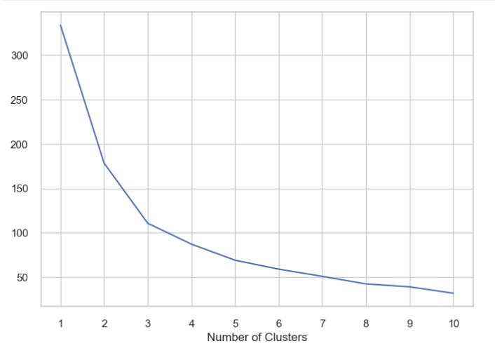
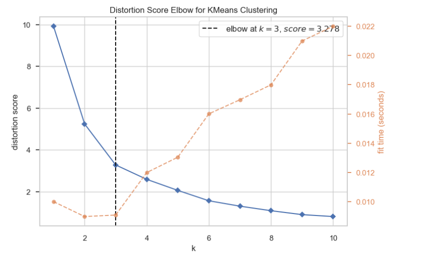
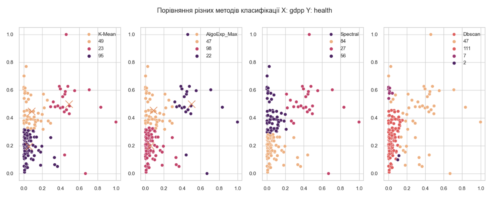
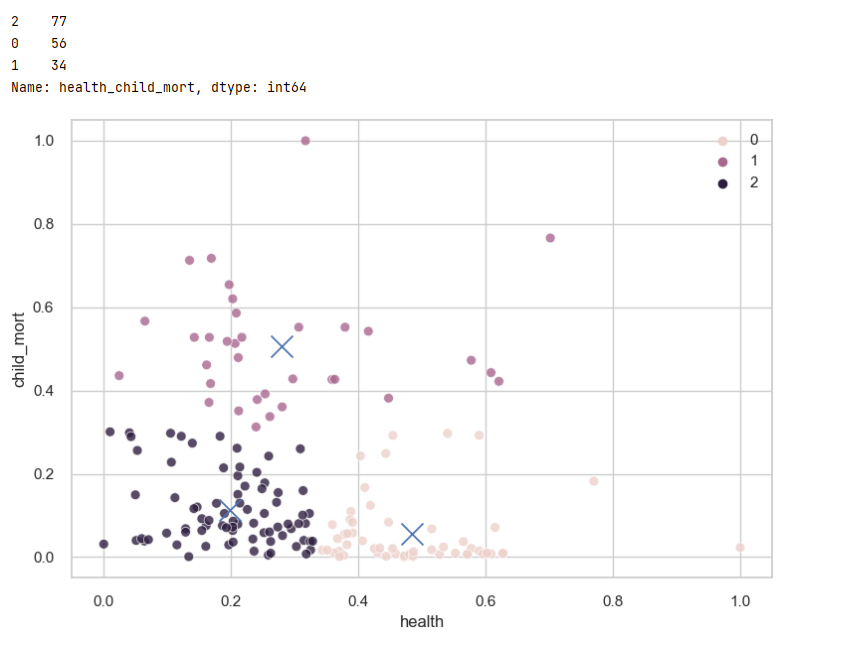
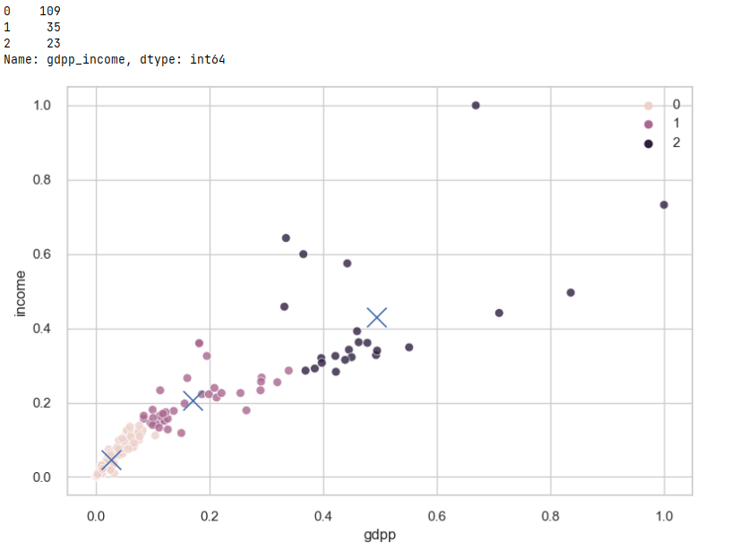
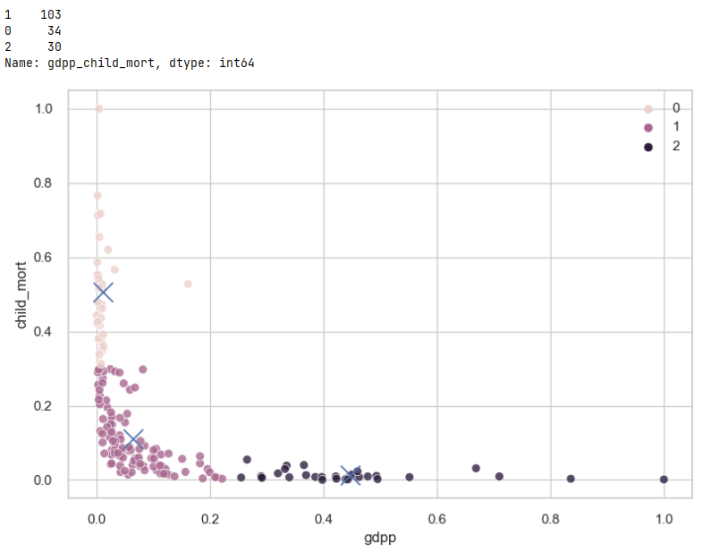
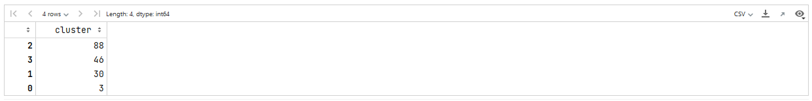
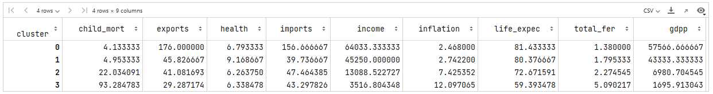

# Лабораторна робота №4

## Завдання:
-   Прочитайте надану в **Супровідних матеріалах** документацію та
    вивчить надані приклади в папці – Examples.

-   Завантажити файл з даними із папки – data.

-   Почніть із необхідної перевірки даних, очищення даних та EDA,
    зробіть однофакторний аналіз, двофакторний аналіз тощо. Візуалізуйте
    закономірності.

-   Ви повинні виконати аналіз викидів для набору даних. Вибрати,
    залишити їх чи видалити залежно від отриманих результатів.

-   Провести кластеризацію, використовуючи k-mean методологію та інші
    (не менше 5) з прикладів та документації.

-   Спробуйте оптимізувати гіпер-параметри для кожного з обраних методів
    кластеризації.

-   Який з протестованих вами методів дав найкращий результат?

-   Візуалізуйте результати кластеризації та оптимізації
    гіпер-параметрів.

-   Агрегуйте дані з аналізом ефективності різних методів кластеризації
    у результуючий dataframe.

-   Підготуйте summary, використовуючи лише необхідні матеріали.

-   Завантажити файл звіту та ipynb з виконаними завданнями на git в
    окрему папку з відповідною назвою лабораторної роботи

## Хід виконання роботи:

### Пошук оптимальної кількість кластерів

Використовуя метод локтя знаходимо оптимальну кількість кластерів

Оптимальною кількістю кластерів буде 3 (найбільший перелом видно в точці 3)

### Пошук найкращого метода кластерізації для сформованих даних
Для перевірки методів візьмемо за xlabe: Валовий дохід, а за ylabel: Здоров'я (
Загальні витрати на охорону здоров'я на душу населення)

### Висновок перевірки роботи різних методоів
Найкращим методом для цього кадру даних є K-Mean, Exp Max.
Метод Найгіршим методом для цього набору даних є Dbscan, на основі щільності точок він визначає їх в один кластер, інші значення більше не кластеризуються та відокремлюють їх від шуму.

#### Для знаходження країн, яким треба гуманітрна допомога, будемо використовувати метод K-mean 

Для сформування висновка проведемо кластерізацію зі усіма рисами 
Кількісна характеристика:

Середня значення зругованих за кластером:

Як можно побачити 3 кластер відноситься по першочергових країн яким треба допомога 
## Результат
Першочергові країни якім треба допомога (36 ще)

| index | name           | gdpp  |
|---|--------------------------|-----|
| 0 | Burundi                  | 231 |
| 1 | Liberia                  | 327 |
| 2 | "Congo, Dem. Rep."       | 334 |
| 3 | Niger                    | 348 |
| 4 | Sierra Leone             | 399 |
| 5 | Madagascar               | 413 |
| 6 | Mozambique               | 419 |
| 7 | Central African Republic | 446 |
| 8 | Malawi                   | 459 |
| 9 | Eritrea                  | 482 |

Другочергові країни яким треба допомога (78 ще)

| index | name           | gdpp  |
|---|-----------------|------|
| 0 | Nepal           | 592  |
| 1 | Tajikistan      | 738  |
| 2 | Bangladesh      | 758  |
| 3 | Cambodia        | 786  |
| 4 | Kyrgyz Republic | 880  |
| 5 | Myanmar         | 988  |
| 6 | Vietnam         | 1310 |
| 7 | India           | 1350 |
| 8 | Uzbekistan      | 1380 |
| 9 | Moldova         | 1630 |
